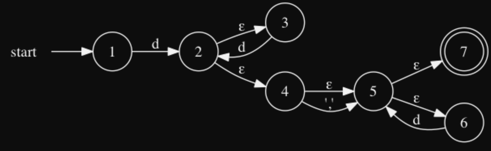

# BSWU BPRD 2018 Jan
## Opgave 1 (20%): Regulære udtryk og automater
### Opgave Beskrivelse:
"_Betragt dette regulære udtryk over alfabetet `{d, ’,’}`, hvor `d` står for decimalt ciffer og `’,’` er komma:_"

`d+ ′ , ′ ? d∗`

"_Ved antagelse af, at `d` svarer til tallene fra `0` til `9` og ’,’ er et komma, så beskriver det regulære udtryk kommatal._"

### Question 1:
#### Spørgsmål:
"_Giv en uformel beskrivelse af sproget (mængden af alle strenge) der beskrives af dette regulære udtryk. Giv mindst 4 eksempler på kommatal der genkendes af dette regulære udtryk og som understøtter din uformelle beskrivelse._"

#### Svar:
Accepts all languages that:
- have at least 1 `d` with any subsequent repeats of `d`.
- this may be followed by a single `','` but it is not necessary.
- it may finish off with a sequence of `d` but this is not necessary.

The regular expression accepts all strings that contains at least 1 or more `d` decimals at the start. Then, the string may have a single `','` as well as be followed by zero or more decimals `d`. 

### Question 2:
#### Spørgsmål:
"_Betragt tilstandsmaskinen nedenfor, og besvar følgende spørgsmål_"
 - **1:** "_Vil tilstandsmaskinen acceptere netop de strenge, som genkendes af det regulære udtryk
   ovenfor?_"
 - **2:** "_Er tilstandsmaskinen deterministisk (`DFA`) eller ikke–deterministisk (`NFA`)?_"

"_Du skal begrunde dine svar._"

#### Svar:
**1:**
The NFA above accepts the strings accepted by the regular expression.

**2:**
Den er NFA fordi den har epsilon. 

### Question 2:
#### Spørgsmål:
"_Angiv et regulært udtryk, der beskriver kommatal, med følgende egenskaber:_"
 - "_Der tillades kommatal uden komma, dvs. heltal._" 
 - "_Der tillades maksimalt et komma, og når der er et komma skal der også være mindst et tal foran og efter kommaet._"
 - "_Den tomme streng genkendes også af det regulære udtryk._"

"_Der lægges vægt på at det regulære udtryk ikke umiddelbart kan skrives kortere._"

`(d+,?d+)?`

#### Svar:
"_Lav en lexer specifikation `kommatal.fsl`, der genkender kommatal, som angivet ovenfor. Generer lexer `kommatal.fs` med fslex og vis at det fungerer med to eksempler._"

