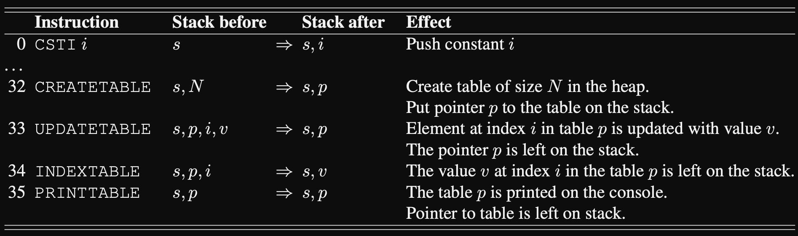

# BSWU BPRD 2021 Jan
## Opgave 1 (25%) MicroC: Betinget udtryk som L–værdi
### Opgave Beskrivelse:
"_I denne opgave udvider vi oversætteren Comp.fs til at håndtere betingede udtryk som **L–værdier**. Betingede
udtryk som **R–værdier** kender vi fra C og C# som `e1 ? e2 : e3`. Eksempelvis vil det betingede udtryk `2 < 3 ? 4 : 5`
returnere værdien 4 fordi 2 er mindre end 3._"

"_Vi definerer et betinget udtryk som **L–værdi** således `e1 ? ae2 : ae3`, hvor e1 er et boolsk udtryk og ae2, ae3
er udtryk der kan anvendes som **L–værdier**. Udtryk i micro–C der kan anvendes som L–værdier kaldes access
expressions og er vist på figur 8.7 i PLC._"

"_For at implementere betingede udtryk som L–værdier udvider vi typen access i filen `Absyn.fs` med
`CondExpAccess` således:_"


```fsharp
and access =
| AccVar of string (* Variable access x *)
| ...
| CondExpAccess of expr * access * access (* Exam Jan 2021 (e1 ? ae2 : ae3) *)
```

"_For så at teste programmet vil du bruge den følgende microC kode:_"
```c++
void main() {
    int x; x = 1;
    int y; y = 2;
    (x < y ? x : y) = 3;
    (x < y ? x : y) = 4;
    print x; println; // Expected 3
    print y; println; // Expected 4
}
```

```fsharp
> fromFile "exam01.c";;
val it : Absyn.program =
 Prog
    [Fundec
    (None,"main",[],
        Block
           [Dec (TypI,"x"); Stmt (Expr (Assign (AccVar "x",CstI 1)));
            Dec (TypI,"y"); Stmt (Expr (Assign (AccVar "y",CstI 2)));
            Stmt
                (Expr
                    (Assign
                        (CondExpAccess
                            (Prim2 ("<",Access (AccVar "x"),Access (AccVar "y")),
                            AccVar "x",AccVar "y"),CstI 3)));
            Stmt
                (Expr
                    (Assign
                        (CondExpAccess
                            (Prim2 ("<",Access (AccVar "x"),Access (AccVar "y")),
                            AccVar "x",AccVar "y"),CstI 4)));
            Stmt (Expr (Prim1 ("printi",Access (AccVar "x"))));
            Stmt (Expr (Prim1 ("printc",CstI 10)));
            Stmt (Expr (Prim1 ("printi",Access (AccVar "y"))));
            Stmt (Expr (Prim1 ("printc",CstI 10)))])]
```

### Question 1:
#### Spørgsmål:
"_Forklar betydningen af følgende konstruktioner `Block`, `Dec`, `Stmt`, `Expr`, `Assign`, `Access` og `AccVar` i ovenstående abstrakte syntaks._"

#### Svar:

| Instruction | Definition                                                                                                                                                  | Effect in `exam01.c`                                   |
|-------------|-------------------------------------------------------------------------------------------------------------------------------------------------------------|--------------------------------------------------------|
| `Block`     | A block statement is a list of statements or declarations.                                                                                                  | Defines a new localized scope for the function `main`. |
| `Dec`       | Declares a new variable.                                                                                                                                    | We declare the variable `x` and `y`.                   |
| `Stmt`      | Currently, a statement is an `if-`, `while-`, `expression-`, `return-` or `block-statement`. We will add the conditional access expression `CondExpAccess`. | We define a new conditional access statement.          |
| `Expr`      | An expression may be a variable `x`, a pointer dereferencing `*p`, or an array element access `a[e]`.                                                       |                                                        |
| `Assign`    | Assign targets a variable and gives it a concrete value.                                                                                                    |                                                        |
| `Access`    | This refers to an access expression. The value of such an expression is the `rvalue` of the access expression (`x` or `*p` or `a[e]`).                      |                                                        |
| `AccVar`    | Access the specified variable.                                                                                                                              |                                                        |

### Question 2:
#### Spørgsmål:
"_Angiv hvilke dele af ovenstående abstrakte syntaks der svarer til henholdsvis `int x;`, `x=1;`, og `(x<y?x:y)=4;` i programmet `exam01.c`._"


#### Svar:

- `int x;`
  - ```fsharp 
    Dec (TypI,"x");
    ```
- `x=1;`
  - ```fsharp 
    Stmt (Expr (Assign (AccVar "x",CstI 1)))
    ```
- `(x<y?x:y)=4;`
  - ```fsharp 
    Stmt
        (Expr
            (Assign
                (CondExpAccess
                    (Prim2 ("<",Access (AccVar "x"),Access (AccVar "y")),
                    AccVar "x",AccVar "y"),CstI 4)));
    ```

### Question 3:
#### Spørgsmål:
"_Udvid lexer specifikation CLex.fsl og parserspecifikation CPar.fsy med support for betingede udtryk
som L–værdier, således at ovenstående abstrakte syntaks er resultatet af at parse programmet exam01.c
med fromFile "exam01.c";;._"

#### Svar:
Changes made to file `Absyn.fs`:
```fsharp

```

Changes made to file `CLex.fsl`
```text
rule Token = parse
  ...
  | "?"             { QMARK }                 
  | ":"             { COLON }  
  ...
```

Changes made to file `CPar.fsy`
```text
%token QMARK COLON
...

%right ASSIGN             /* lowest precedence */
%nonassoc PRINT
%right QMARK COLON
...

Access:
    NAME                                { AccVar $1           }
  ...
  | Expr QMARK Access COLON Access      { CondExpAccess($1, $3, $5) }
;
```
_**Note!**_ We for precedence we want both QMARK and COLON to be low but still put their RHS evaluation first. 

Test print should give:
```fsharp
> fromFile "./Exam/exam01.c";;
val it: Absyn.program =
  Prog
    [Fundec
       (None, "main", [],
        Block
          [Dec (TypI, "x"); Stmt (Expr (Assign (AccVar "x", CstI 1)));
           Dec (TypI, "y"); Stmt (Expr (Assign (AccVar "y", CstI 2)));
           Stmt
             (Expr
                (Assign
                   (CondExpAccess
                      (Prim2 ("<", Access (AccVar "x"), Access (AccVar "y")),
                       AccVar "x", AccVar "y"), CstI 3)));
           Stmt
             (Expr
                (Assign
                   (CondExpAccess
                      (Prim2 ("<", Access (AccVar "x"), Access (AccVar "y")),
                       AccVar "x", AccVar "y"), CstI 4)));
           Stmt (Expr (Prim1 ("printi", Access (AccVar "x"))));
           Stmt (Expr (Prim1 ("printc", CstI 10)));
           Stmt (Expr (Prim1 ("printi", Access (AccVar "y"))));
           Stmt (Expr (Prim1 ("printc", CstI 10)))])]
```

### Question 4:
#### Spørgsmål:
"_Lav et oversætterskema (eng. compilation schemes) for oversættelse af betingede udtryk som L–værdier, svarende til dem der findes i figur 8.7 i PLC:_"

```text
S[[if (e) stmt1 else stmt2 ]] =
    E[[e ]]
    IFZERO lab1
    S[[stmt1 ]]
    GOTO lab2
    lab1: S[[stmt2 ]]
    lab2: ...
```

#### Svar:
Access:
```text
S[[ (e) ? acc1 : acc2 ]] =
    E[[ e ]]
    IFZERO lab1
    A[[ acc1 ]]
    GOTO lab2
    lab1: A[[ acc2 ]]
    lab2: ...
```

**OR**

Access Expression:
```text
S[[ (e) ? acc1 : acc2 ]] =
    E[[ e ]]
    IFZERO lab1
    A[[ acc1 ]] LDI
    GOTO lab2
    lab1: A[[ acc2 ]] LDI
    lab2: ...
```

### Question 5:
#### Spørgsmål:
""

#### Svar:


```fsharp
// Pretty much copy-pasta from Cond() in cEval

and cAccess access varEnv funEnv : instr list =
    match access with 
    ...    
    | CondExpAccess(e1, ae1, ae2) ->
        let lab1    = newLabel()
        let lab2    = newLabel()
        
        cExpr e1 varEnv funEnv
        @ [IFZERO lab1]
        @ cAccess ae1 varEnv funEnv
        @ [GOTO lab2]
        @ [Label lab1]
        @ cAccess ae2 varEnv funEnv
        @ [Label lab2]
```

"Lav to eksempelprogrammer exam02.c og exam03.c, som viser at din implementation af betingede
udtryk som L–værdier også fungerer for pointer dereferencing (*e) og tabeller (a[i]). Oversæt og inkluder
resultatet af at afvikle de to programmer. Du kan tage udgangspunkt i exam01.c og eksempelvis erklære x og y som tabeller, hver med 1
element og genbruge logikken i exam01.c, f.eks. int x[1];. Du kan også erkære x og y som pegere,
f.eks. int *x;."

```c++
void main() {
  int x[1]; x[0] = 1;
  int y[1]; y[0] = 2;
  ...
}
```


## Opgave 2 (25%) MicroC: Alias
### Opgave Beskrivelse:
"_I denne opgave udvider vi oversætteren `Comp.fs` til at håndtere alias af variable. Betragt nedenstående eksempel `exam04.c`:_"

```c++
void main(int n) {
  int i;
  i=0;
  alias j as i; // Make local variable j an alias of local variable i
  while (j < n) {
    print j;
    i=i+1;
  }
}
```

### Question 1:
"_Udvid lexer specifikation `CLex.fsl` og parserspecifikation `CPar.fsy` med support for `alias`, således at ovenstående abstrakte syntaks er resultatet af at parse programmet `exam04.c` med `fromFile "exam04.c";;`._"

Changes made to `CLex.fsl`:
```text
let keyword s =
    match s with
    ...
    | "as"      -> AS
    | "alias"   -> ALIAS
```


Changes made to `CPar.fsy`:
```text
%token AS ALIAS

...


StmtOrDecSeq:
    /* empty */                          { [] }
  | Stmt StmtOrDecSeq                    { Stmt $1 :: $2 }
  | Vardec SEMI StmtOrDecSeq             { Dec (fst $1, snd $1) :: $3 }
  | ALIAS NAME AS NAME SEMI StmtOrDecSeq { Alias ($2, $4) :: $6 }
;
```

```fsharp
> fromFile "./Exercises/exam04.c";;
val it: Absyn.program =
  Prog
    [Fundec
       (None, "main", [(TypI, "n")],
        Block
          [Dec (TypI, "i"); Stmt (Expr (Assign (AccVar "i", CstI 0)));
           Alias ("j", "i");
           Stmt
             (While
                (Prim2 ("<", Access (AccVar "j"), Access (AccVar "n")),
                 Block
                   [Stmt (Expr (Prim1 ("printi", Access (AccVar "j"))));
                    Stmt
                      (Expr
                         (Assign
                            (AccVar "i",
                             Prim2 ("+", Access (AccVar "i"), CstI 1))))]))])]

```

### Question 2:
#### Spørgsmål:
"_Med udgangspunkt i nedenstående stack frame (figur 8.2 i PLC ) for funktionen main i `exam04.c`, udfyld
de manglende lokale variable efter at `alias j as i` er afviklet, <fill out>._"


```text
-----stack grows from left to right ----->
-----+---------+--------+------------+----------
... |ret addr | old bp | <fill out> | temps ...
-----+---------+--------+------------+----------
```


#### Svar:
...

### Question 3:
#### Spørgsmål:
"Udvid `Comp.fs` med oversættelse af alias som beskrevet ovenfor. Der er ikke brug for at definere nye bytekode instruktioner."

**Hint**: "_Du skal udvide funktionen cStmtOrDec i og med at konstruktionen Alias(x,y) er tilføjet typen
stmtordec_"

**Hint**: "_For `Alias(x,y)` er opgaven at udvide environment `varEnv` med en ny variabel `x`. Variablen `x`
skal arve typen og adressen fra `y`, som fås ved at slå `y` op i omgivelsen `varEnv`. Der er to tilfælde: `y` kan
være en lokal eller en global variabel._"

"_Når du er færdig skal du kore programmet `exam04.out` med bytekodefortolkeren Machine.java og inkluder resultatet
i din besvarelse. Kommandoen er: `java Machine exam04.out 10`_"

#### Svar:

Changes made to file `Comp.fs` at function `cStmtOrDec`
```fsharp
and cStmtOrDec stmtOrDec (varEnv : varEnv) (funEnv : funEnv) : varEnv * instr list = 
    match stmtOrDec with 
    ...
    | Alias (s1, s2) ->
        // [1] We look up the variable we want to make an alias of, retrieving from it the type "typ"
        //     and its "var" - whether or not it is a local or global variable. 
        let (var, typ) = lookup (fst varEnv) s2
        
        // [2] We add to the environment a new variable, with the name of "s1" but the types and address of
        //     s2 - in this case "var" and "typ".
        let updEnv = (((s1, (var, typ)) :: fst varEnv), snd varEnv)
        
        // [3] We don't need to create any new instructions, as we are just introducing a new variable.
        //     Subsequently, we just return an empty list for the second pair parameter.
        (updEnv, [])
```

Running the command `java Machine exam04.out 10`
```text 
> java Machine ./Exercises/exam04.out 10
0 1 2 3 4 5 6 7 8 9
```

### Question 4:
#### Spørgsmål:
"_Lav et eksempelprogram `exam05.c`, som viser et eksempel med alias j as i, hvor i er en global variabel. Oversæt og inkluder resultatet af at afvikle programmet._"

"**Hint**: _Du kan tage udgangspunkt i exam04.c og gøre i til en global variabel._"

#### Svar:
```fsharp
// Running the command:
> compileToFile (fromFile "./Exercises/exam05.c") "./Exercises/exam05.out";; 
val it: Machine.instr list =
  [INCSP 1; LDARGS; CALL (1, "L1"); STOP; Label "L1"; CSTI 0; CSTI 0; STI;
   INCSP -1; GOTO "L3"; Label "L2"; CSTI 0; LDI; PRINTI; INCSP -1; CSTI 0;
   CSTI 0; LDI; CSTI 1; ADD; STI; INCSP -1; INCSP 0; Label "L3"; CSTI 0; LDI;
   GETBP; CSTI 0; ADD; LDI; LT; IFNZRO "L2"; INCSP 0; RET 0]

// Running with machine:
> java Machine "./Exercises/exam05.out" 10  
0 1 2 3 4 5 6 7 8 9 
```

## Opgave 3 (30%) List–C: Tabeller på hoben
### Opgave Beskrivelse: 
"_I denne opgave implementerer vi tabeller (eng. arrays), således at de allokeres på hoben (eng. heap). Sproget
`list–C` er beskrevet i afsnit 10.7._"

"_Første element efter header, adresse p + 1, indeholder antal elementer i tabellen (N) og derefter følger tabellens
indhold. En tabel fylder `N + 2` ord på hoben. Som eksempel, er tabellen på størrelse 3 med elementerne `42`, `43` og `44` repræsenteret nedenfor, startende på adresse `112` i hoben._"


"_Vi udvider list–C med fire nye funktioner:_"

- `createTable(N)`:
  - _allokerer en tabel af størrelse N på hoben. Alle elementer initialiseres til værdien `0`.
    Hvis `N < 0` skal programmet stoppe med passende fejlmeddelelse._
- `updateTable(N)`:
  - _updaterer tabellen t med værdien v på indeks `i`. Elementerne indekseres fra `0` til
    `N−1`, hvor N er antallet af elementer i `t`. Programmet skal stoppe med passende fejlmeddelelse, hvis `i < 0`
    eller hvis `i ≥ N`._
- `indexTable(t, i)`:
  - _returnerer værdien i indeks i for tabel `t`. Programmet skal stoppe med passende fejlmeddelelse, hvis `i < 0` eller hvis `i ≥ N`._
- `printTable(t)`:
  - udskriver tabellen t på skærmen.

  
"_Til at teste kommer vi til at bruge det følgende eksempel `exam10.lc`_"

```c++
void main() {
  dynamic t;
  t = createTable(3);
  updateTable(t,0,42);
  updateTable(t,1,43);
  updateTable(t,2,44);
  print indexTable(t,0);
  print indexTable(t,1);
  print indexTable(t,2);
  printTable(t);
}
```

### Question 1:
#### Spørgsmål:
"_Den abstrakte syntaks `Absyn.fs` indeholder mulighed for primitiver med 1 (`Prim1`) og 2 (`Prim2`) argumenter. For at repræsentere funktionen updateTable har du brug for et primitiv med `3` argumenter. Udvid typen `expr` i `Absyn.fs` således, at alle funktioner ovenfor kan repræsenteres. Vis din tænkte abstrakte repræsentation af `updateTable(t,2,44);`._"

#### Svar:
```fsharp
type typ =
  | TypI                             (* Type int                    *)
  | TypC                             (* Type char                   *)
  | TypD                             (* Type dynamic                *)
  | TypA of typ * int option         (* Array type                  *)
  | TypP of typ                      (* Pointer type                *)
  
and expr =                                                         
  ...
  | Prim1 of string * expr           (* Unary primitive operator    *)
  | Prim2 of string * expr * expr    (* Binary primitive operator   *)
  | Prim3 of string * expr * expr * expr  (* Exam *)
  ...
```

### Question 2:
#### Spørgsmål:
"_Udvid lexer– og parser–specifikationen således at ovenstående funktioner kan parses og generer et passende abstrakt syntakstræ. Vis det abstrakte syntakstræ du får ved oversættelse af `exam10.lc` ovenfor._"

**Hint**: "_For at printe det abstrakte syntakstræ kan du ændre funktionen `fromFile` i `Parse.fs` således at træet udskrives inden det returneres._"

#### Svar:
Changes to file `CLex.fsl`:
```text
let keyword s =
    match s with
    ...      
    | "createTable" -> CREATETABLE
    | "updateTable" -> UPDATETABLE
    | "indexTable"  -> INDEXTABLE
    | "printTable"  -> PRINTTABLE
    ...
```

Changes to file `CPar.fsy`:
```text
ExprNotAccess:                                                 
    AtExprNotAccess                     { $1                    }
  | Access ASSIGN Expr                  { Assign($1, $3)        }
  ...
  | CREATETABLE LPAR Expr RPAR                         { CreateTable($3)           }
  | UPDATETABLE LPAR Access COMMA Expr COMMA Expr RPAR { UpdateTable($3, $5, $7) }
  | INDEXTABLE  LPAR Access COMMA Expr RPAR            { IndexTable($3, $5)      }
  | PRINTTABLE  LPAR Access RPAR                       { PrintTable($3)          }
```

**Note** Be careful when dealing with values in the `ExprNotAccess` section. Originally, I had added a `SEMI` token at the end of each of the statements above. This resulted in a parser error as the `SEMI` is already handled by the `StmtM` which adds it after every expression. 

```text
StmtM:  /* No unbalanced if-else */
    Expr SEMI                           { Expr($1)              }
    ...
; 

Expr: 
    Access                              { Access $1             }
  | ExprNotAccess                       { $1                    }
; 
```

Resulting print:
```fsharp
Prog
  [Fundec
     (None, "main", [],
      Block
        [Dec (TypD, "t");
         Stmt (Expr (Assign (AccVar "t", CreateTable (CstI 3))));
         Stmt (Expr (UpdateTable (AccVar "t", CstI 0, CstI 42)));
         Stmt (Expr (UpdateTable (AccVar "t", CstI 1, CstI 43)));
         Stmt (Expr (UpdateTable (AccVar "t", CstI 2, CstI 44)));
         Stmt (Expr (Prim1 ("printi", IndexTable (AccVar "t", CstI 0))));
         Stmt (Expr (Prim1 ("printi", IndexTable (AccVar "t", CstI 1))));
         Stmt (Expr (Prim1 ("printi", IndexTable (AccVar "t", CstI 2))));
         Stmt (Expr (PrintTable (AccVar "t")))])]
```


### Question 3:
#### Spørgsmål:
"_Tilføj fire nye bytekode instruktioner CREATETABLE, UPDATETABLE og INDEXTABLE og PRINTTABLE til at allokere, opdatere, læse fra og udskrive tabeller:_"



"_I tabellen ovenfor er den eksisterende bytekode instruktion `0 CSTI` medtaget til sammenligning. Du kan benytte tagget 1 for tabeller._"

"_I `listmachine.c` skal du anvende allocate ved implementationen af `CREATETABLE`. Derudover
skal du huske at tagge (`Tag`) og untagge (`Untag`) de skalare værdier. Eksempelvis, for `CREATETABLE`,
er de skalare værdier `N` samt initialisering af elementerne til `0`. For `UPDATETABLE` er eksempelvis i en
skalar værdi, som skal untagges når den hentes fra stakken.
Bytekode instruktionen `PRINTTABLE` p, hvor p er en tabel med N elementer, skal printes således: `[v0, . . . , vN−1]`._"

**Hint** "_Størrelsen af en tabel `N`, på plads `p[1]`, når `p` er peger til tabellen, er også en skalar værdi. Det
betyder at den skal tagges når tabellen oprettes (`CREATETABLE`) og untagges hvis/når den læses i de andre
bytekode instruktioner._"

#### Svar:

- CreateTable
  1. Pop the size `N` from the stack
  2. Use `allocate` to create a block (_in the heap_) with a header and N elements. 
  3. Initialize the table with elements `0`.
  4. Push the table pointer to the top of the stack


### Question 4:
#### Spørgsmål:
"_Udvid `Comp.fs` til at generere kode for de fire nye funktioner._"


#### Svar:

### Question 5:
#### Spørgsmål:
"_Kør ovenstående eksempelprogram `exam10.lc` og vis uddata_"

### Question 6:
#### Spørgsmål:
"_Beskriv de vigtigste test cases man bør lave for at teste `createTable`. Implementer mindst to test cases og vis resultatet af at køre testene._"

### Question 7:
#### Spørgsmål:
"_Beskriv de vigtigste test cases man bør lave for at teste `updateTable`. Implementer mindst to test cases og vis resultatet af at køre testene._"


## Opgave 4 (20%) MicroML: Doubles
### Opgave Beskrivelse:
"_Opgaven er at udvide funktionssproget med doubles, således at vi kan evaluere udtryk med kommatal, se
eksempel `exam01` nedenfor:_"

```fsharp
let exam01 = Letfun("f1", "x", Prim("+", Var "x", CstD 1.0), Call(Var "f1", CstD 12.0));
```

### Question 1:
#### Spørgsmål:
"_Udvid typen expr i Absyn.fs med en konstruktør CstD, der repræsenterer konstante kommatal. Vis at eksempel exam01 accepteres._"

#### Svar:
```fsharp
type expr = 
  ...
  | CstD of double
  ...

val it: expr =
  Letfun
    ("f1", "x", Prim ("+", Var "x", CstD 1.0), Call (Var "f1", CstD 12.0))
```

### Question 2:
#### Spørgsmål:
"_Udvid typen value og funktionen `eval` i `HigherFun.fs`, således at udtryk med kommatal kan evalueres. De primitive operatorer `∗`, `+`, `−`, `=`, `<` defineres, således at de enten fungerer for to heltal eller to kommatal. Funktionen eval skal fejle, hvis man forsøger at anvende en operator på et heltal og kommatal samtidigt._"

"_Vi resultatet af at køre `exam01` ovenfor og eksempel `exam02Err` nedenfor:_"

#### Svar:
Changes made to file `FunPar.fsy`:

```text
rule Token = parse
  ...
  | ['0'-'9']+ '.' ['0'-'9']+ { CSTDOUBLE (System.Double.Parse (lexemeAsString lexbuf)) }
  ...
```

**Key!** Giving this to our lexer allows the parser to recognize decimal numbers. Notice how it is essentially just the integer one duplicated.

Changes made to file `FunLex.fsl`:

```text
%token <double> CSTDOUBLE

Const:
    CSTINT                              { CstI($1)               }
  | CSTBOOL                             { CstB($1)               }
  | CSTDOUBLE                           { CstD($1)               }      // Corresponds to the type in `Absyn.fs` which we just added
;
```

Changes made to `HigherFun.fs`
```fsharp
| Prim(ope, e1, e2) -> 
      let v1 = eval e1 env
      let v2 = eval e2 env
      match (ope, v1, v2) with
      | ("*", Int i1, Int i2) -> Int (i1 * i2)
      | ("+", Int i1, Int i2) -> Int (i1 + i2)
      | ("-", Int i1, Int i2) -> Int (i1 - i2)
      | ("=", Int i1, Int i2) -> Int (if i1 = i2 then 1 else 0)
      | ("<", Int i1, Int i2) -> Int (if i1 < i2 then 1 else 0)
      | ("*", Double i1, Double i2) -> Double (i1 * i2)
      | ("+", Double i1, Double i2) -> Double (i1 + i2)
      | ("-", Double i1, Double i2) -> Double (i1 - i2)
      | ("=", Double i1, Double i2) -> Double (if i1 = i2 then 1 else 0)
      | ("<", Double i1, Double i2) -> Double (if i1 < i2 then 1 else 0)
      |  _ -> failwith "unknown primitive or wrong type"
```

Example output:
```fsharp
// Running 'exam02Err':
let exam02Err = Prim("+", CstD 23.0, CstI 1)
> run exam02Err;;
System.Exception: unknown primitive or wrong type

// Example 1:
> fromString @"let x = 2.177 in x + 2.22 end";;
val it: expr = Let ("x", CstD 2.177, Prim ("+", Var "x", CstD 2.22))
> run it;;
val it: HigherFun.value = Double 4.397

// Example 2:
> fromString @"let x = 2.0 in x - 2.2 end";;
val it: expr = Let ("x", CstD 2.0, Prim ("-", Var "x", CstD 2.2))
> run it;;
val it: HigherFun.value = Double -0.2
```


### Question 3:
#### Spørgsmål:
"_For at konvertere mellem heltal og kommatal definerer vi to nye primitiver:_"

 - `toInt`
   - som konverterer et kommatal til heltal. Kommatallet skal trunkeres mod nul, dvs. du kan anvende F# (int) type cast.
 - `toDouble` 
   - som konverterer et heltal til kommatal. Du kan anvende F# (double) type cast.

"_Primitiverne tager kun et argument, hvorfor vi har brug for en ny konstruktør `Prim1` i typen expr i `Absyn.fs`. Derudover har vi brug for at udvide eval i `HigherFun` med evaluering af de to primitiver. Vis uddata af at køre `exam05`. Lav et testeksempel, og vis uddata, der anvender primitivet `toDouble`._"

#### Svar:

Changes made to `Absyn.fs`
```fsharp
type expr = 
  ...
  | Prim1 of string * expr 
  ...
```

Changes made to `FunLex.fsl`
```text
let keyword s =
    match s with
    ...
    | "toInt" -> TOINT
    | "toDouble" -> TODOUBLE
    | _       -> NAME s
}
```

Changes made to `FunPar.fsy`
```text
%token TOINT TODOUBLE

Expr:
    AtExpr                              { $1                     }
  | AppExpr                             { $1                     }
  ...
  | TOINT Expr                          { Prim1("toInt", $2)     }
  | TODOUBLE Expr                       { Prim1("toDouble", $2)  }
;
```

Changes made to `HigherFun.fs`
```fsharp
| Prim1(convTyp, e) ->
      let v = eval e env
      match (convTyp, v) with
      | ("toInt", Double v)    -> Int (int v)
      | ("toDouble", Int v)    -> Double (double v)
      | ("toInt", Int v)       -> Int v
      | ("toDouble", Double v) -> Double v
      | _ -> failwith "unknown primitive or wrong type"
```


Examples:
```fsharp
// Running "exam05":
> let exam05 = Let("x",CstD 23.0, Prim("*",CstI 2,Prim1("toInt", Var "x")));;
val exam05: expr = Let ("x", CstD 23.0, Prim ("*", CstI 2, Prim1 ("toInt", Var "x")))
> run exam05;;
val it: HigherFun.value = Int 46

// Running own example for "toDouble":
> fromString @"let x = 2 in (toDouble x) + 2.0 end";;
val it: expr =
  Let ("x", CstI 2, Prim ("+", Prim1 ("toDouble", Var "x"), CstD 2.0))
> run it;;
val it: HigherFun.value = Double 4.0
```

### Question 4:
#### Spørgsmål:
"_Figur 6.1 på side 102 i PLC viser typeinferensregler for funktionssproget, som vi har udvidet med doubles
(double). Nedenfor ses et udvalg af typeregler for introduktion af kommatal:_"

#### TODO!